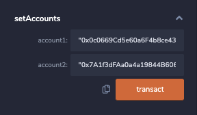
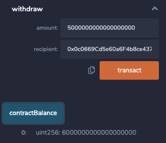

# Smarter Smart Contracts

We will create a Solidity smart contract that accepts two user addresses. These addresses will be able to control a joint savings account. The smart contract will use ether management functions to implement a financial institution’s requirements for providing the features of the joint savings account. These features will consist of the ability to deposit and withdraw funds from the account. To do this we will create a Joint Savings Account Contract in Solidity, Compile and Deploy the Contract in the JavaScript VM, and Interact with the Deployed Smart Contract.

_Defining the Smart Contract_

---

## Technologies

This project uses the web version of Remix IDE to Code in the Solidity Language:

- Remix IDE: to build and test smart contracts that you create with Solidity. The Remix IDE is an open source application for developing, deploying, and administering smart contracts that run in Ethereum-based blockchains. We can use this IDE for the entire development cycle of smart contracts and as a playground for teaching and learning Ethereum.

---

## Installation

There are no software installs needed for this smart contract. Simply visit the [Web version of REMIX IDE](https://remix.ethereum.org/) to use the code found in the joint_savings.sol file or to create your own smart contract.

---

## Results

Here are a couple of screenshots showing interactions with the of the Compiled and Deployed Smart Contract

_^ Setting Accounts_

_^ Making a Deposit to the Smart Contract_

_^ Making a Withdrawal from one of the Accounts_

## Contributors

Michael Husary was the main contributer along with the instructional staff. 

--- 
